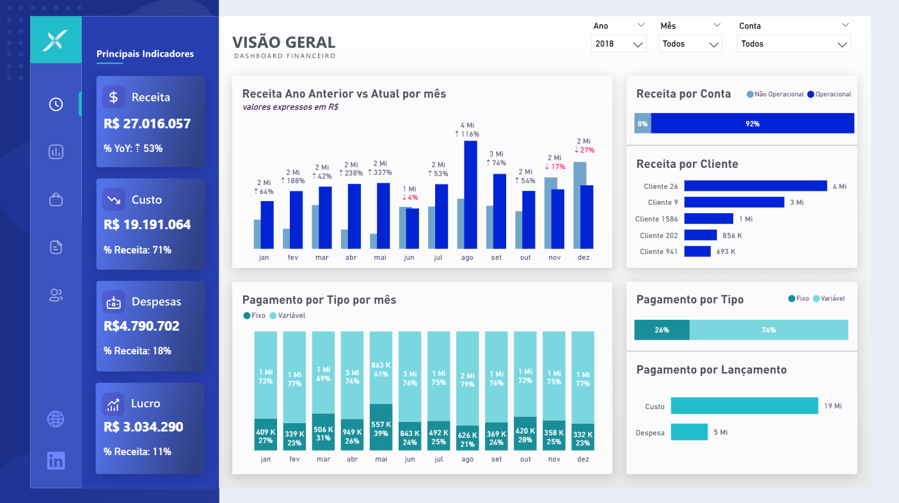

# 📊 Relatório Financeiro - Descritivo da Análise do Exercício

## 📌 Descrição
Este relatório em **Power BI** apresenta uma análise **financeira consolidada**, com foco no acompanhamento de **Receita, Custo, Despesas e Lucro**.  
O painel foi desenvolvido para fornecer **insights estratégicos** à **Equipe Financeira**.
- Consulte [pipeline-financeiro](./pipeline-financeiro) para saber mais sobre a automação do ETL.
- Ou, consulte [previsao-custos](./previsao-custos) para saber mais sobre a ferramenta de provisionamento de fluxo de caixa (Machine Learning - Análise Preditiva).

## 🚀 Objetivos do Relatório
- Monitorar a **receita mensal** comparando **Ano Atual vs Ano Anterior (YoY)**.
- Avaliar a **composição de custos e despesas** e seu peso sobre a receita.
- Acompanhar **KPIs** principais (Receita, %YoY, %Receita por Custo/Despesa, Lucro).
- Identificar **participação por contas** (operacional vs não operacional) e **por clientes**.
- Analisar a **distribuição dos pagamentos** (**Fixo x Variável** e por lançamento).
- Fornecer **visão consolidada** com possibilidade de **análise granular**.

## 📊 Imagens do Relatório

## 🗂️ Fontes de Dados
- **Sistema Online** → Via API REST.
- **Supabase - PostgreSQL** → Data Warehouse de dados transformados.

## 🔄 Atualização dos Dados
- Atualização diária do banco de dados com **Python e Windows Task Scheduler**
- Atualização diária do dashboard com **Power BI Services**.

## 📈 Funcionalidades
- **Comparação temporal**: Ano atual vs ano anterior por mês (com variação %).
- **KPIs financeiros**: Receita, Custo, Despesa e Lucro (com % sobre a receita).
- **Receita por Conta**: **Operacional vs Não Operacional**.
- **Receita por Cliente**: ranking dos principais clientes.
- **Pagamentos**: **por Tipo** (fixo x variável) e **por Lançamento**.
- **Filtros dinâmicos**: **Ano**, **Mês** e **Conta**.

## 👥 Público-Alvo
- **Diretoria Financeira** – visão estratégica e consolidada.
- **Gerência Administrativa/Controladoria** – gestão de custos e despesas.
- **Analistas Financeiros** – detalhamento de pagamentos e clientes.

## 📌 Tecnologias Utilizadas
- **Python** (Extração API, ETL e conexão com data warehouse).
- **PostgreSQL** (Armazenamento e consultas).
- **Power BI** (Modelagem, DAX, Visualização).
